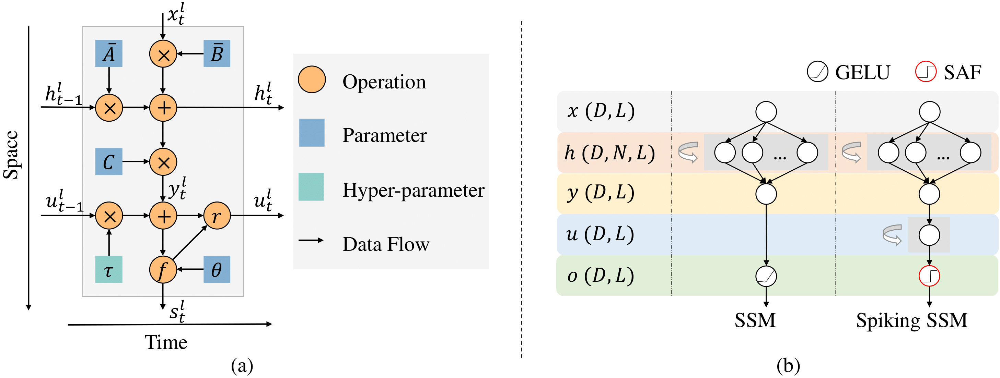

# Surrogate Dynamic Network (SDN) and SpikingSSMs



> **SpikingSSMs: Learning Long Sequences with Sparse and Parallel Spiking State Space Models**  
> Shuaijie Shen*, Chao Wang*, Renzhuo Huang, Yan Zhong, Qinghai Guo, Zhichao Lu, Jianguo Zhang, Luziwei Leng  
> Paper: [https://arxiv.org/abs/2408.14909](https://arxiv.org/abs/2408.14909)  

This repository provides the official implementations and experiments for **SDN** (Surrogate Dynamic Network) and **SpikingSSMs** (Spiking State Space Models).

---

## Table of Contents

- [Surrogate Dynamic Network (SDN) and SpikingSSMs](#surrogate-dynamic-network-sdn-and-spikingssms)
  - [Table of Contents](#table-of-contents)
  - [Overview](#overview)
  - [Installation](#installation)
    - [Dependencies](#dependencies)
      - [SDN Requirements](#sdn-requirements)
      - [SpikingSSMs Requirements](#spikingssms-requirements)
  - [Quick Start](#quick-start)
    - [Generating Datasets](#generating-datasets)
    - [Training SDN](#training-sdn)
    - [Model Reduction](#model-reduction)
  - [Reproducing SpikingSSMs Experiments](#reproducing-spikingssms-experiments)
  - [Citation](#citation)
  - [License](#license)

---

## Overview

This repository contains two core components:
1. **SDN**: A lightweight module for simulating spiking neuron dynamics.
2. **SpikingSSMs**: A novel architecture combining spiking neural networks with state space models for long-sequence tasks.

---

## Installation

### Dependencies

#### SDN Requirements
- Python 3.8+
- PyTorch ≥1.10
- loguru

Install via conda/pip:
```bash
# PyTorch with CUDA 11.8
conda install pytorch torchvision pytorch-cuda=11.8 -c pytorch -c nvidia

# Loguru
pip install loguru
```

#### SpikingSSMs Requirements
Clone the official S4 repository and install dependencies:
```bash
git clone https://github.com/state-spaces/s4.git
cd s4
# Follow S4's installation instructions
```

---

## Quick Start

### Generating Datasets

1. Generate training data:
```bash
python generate.py dataset
```

2. Generate test data:
```bash
python generate.py dataset -n test
```

**Dataset Structure** ([dataset/](dataset/)):
```
training-mem-T1024-N(0.0,1.0)-50000-tau_0.2.pt
test-mem-T1024-N(0.0,1.0)-50000-tau_0.2.pt
```

Each file contains:
- `input`: Input current tensor (shape: [50000, 1024])
- `mem`: Attenuated membrane potential (shape: [50000, 1024])
- `spike`: Spike train (shape: [50000, 1024])

### Training SDN

```bash
python train.py \
  --training 'dataset/training-mem-T1024-N(0.0,1.0)-50000-tau_0.2.pt' \
  --test 'dataset/test-mem-T1024-N(0.0,1.0)-50000-tau_0.2.pt' \
  --save exp1
```

Logs and checkpoints will be saved in [exp1/](exp1/).

### Model Reduction

Optimize SDN for inference:
```bash
jupyter notebook convert.ipynb  # Follow interactive instructions
```

---

## Reproducing SpikingSSMs Experiments

1. Clone and setup S4:
```bash
git clone https://github.com/state-spaces/s4.git
cd s4
# Install S4 dependencies (refer to their documentation)
```

2. Integrate our components:
```bash
cp -r /path/to/this/repo/src ./src
cp -r /path/to/this/repo/models ./models
cp -r /path/to/this/repo/configs ./configs
```

3. Run CIFAR-10 experiment:
```bash
python -m train experiment=spikingssm/cifar
```

---

## Citation

If you use this work in your research, please cite:
```bibtex
@article{Shen_Wang_Huang_Zhong_Guo_Lu_Zhang_Leng_2025,
  title   = {SpikingSSMs: Learning Long Sequences with Sparse and Parallel Spiking State Space Models},
  volume  = {39},
  url     = {https://ojs.aaai.org/index.php/AAAI/article/view/34245},
  doi     = {10.1609/aaai.v39i19.34245},
  number  = {19},
  journal = {Proceedings of the AAAI Conference on Artificial Intelligence},
  author  = {Shen, Shuaijie and Wang, Chao and Huang, Renzhuo and Zhong, Yan and Guo, Qinghai and Lu, Zhichao and Zhang, Jianguo and Leng, Luziwei},
  year    = {2025},
  month   = {Apr.},
  pages   = {20380-20388}
}
```

---

## License

This project is licensed under the [MIT License](LICENSE).